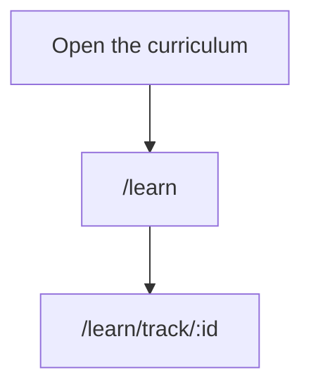
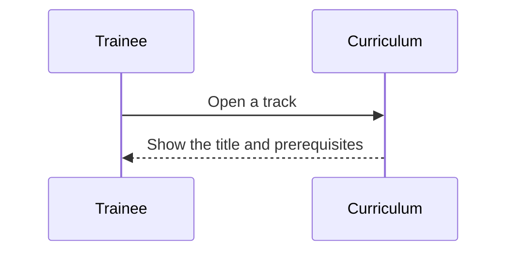
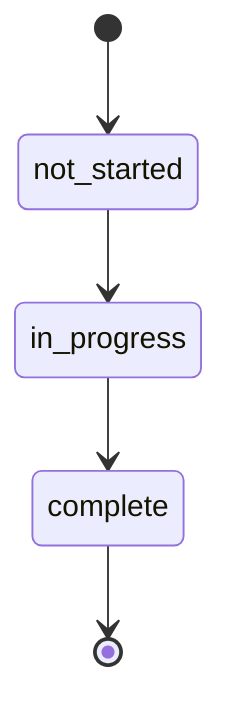
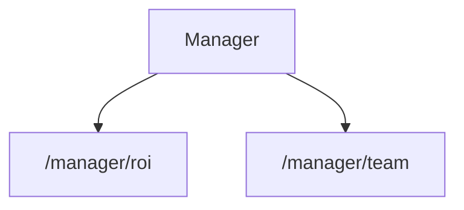
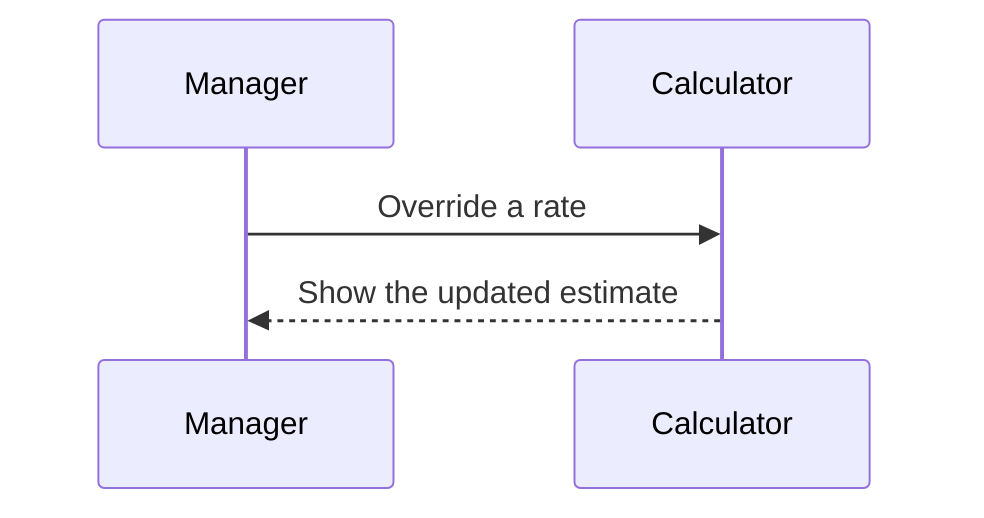
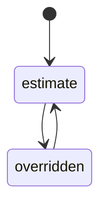

# Journey maps

## Trainee

The trainee home is `/learn`. A single track is `/learn/track/:id`.

```mermaid
flowchart TD
  openHome[Open the curriculum] --> trackList["/learn"]
  trackList --> trackDetail["/learn/track/:id"]
```

```mermaid
sequenceDiagram
  participant Trainee
  participant Curriculum
  Trainee->>Curriculum: Open a track
  Curriculum-->>Trainee: Show the title and prerequisites
```

```mermaid
stateDiagram-v2
  [*] --> not_started
  not_started --> in_progress
  in_progress --> complete
  complete --> [*]
```

## Manager

The return view is `/manager/roi`. The team view is `/manager/team`.

```mermaid
flowchart TD
  manager[Manager] --> roiPage["/manager/roi"]
  manager --> teamPage["/manager/team"]
```

```mermaid
sequenceDiagram
  participant Manager
  participant Calculator
  Manager->>Calculator: Override a rate
  Calculator-->>Manager: Show the updated estimate
```

```mermaid
stateDiagram-v2
  [*] --> estimate
  estimate --> overridden
  overridden --> estimate
```
